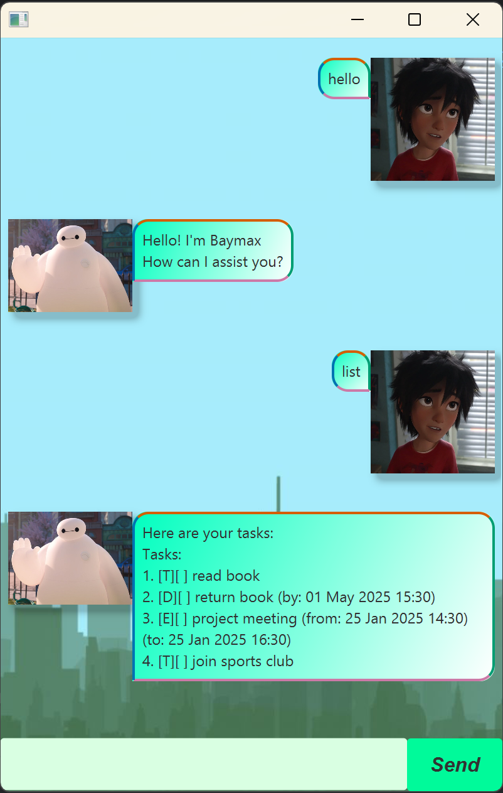

# Baymax User Guide


This is Baymax, your personal task companion!

## Adding deadlines

Tell Baymax that you want to add a task with a deadline

Example: `deadline Finish homework /by 2025-01-27 12:30`

Baymax should respond accordingly

```
Got it. Added this task: 
[D][] Finish homework (by: 27 Jan 2025 12:30)
Now you have 20 tasks in the list.
```

## Deleting tasks

Tell Baymax that you want to delete a task

Example: `delete 4`

Baymax should respond accordingly

```
Task removed!
  [D][] Finish homework (by: 27 Jan 2025 12:30)
Now you have 19 tasks in the list.
```


## List tasks

Tell Baymax to show you all your tasks

Example: `List`

Baymax should respond accordingly

```
Here are your tasks:
Tasks:
1. [T][] read book
2. [D][] Finish homework (by: 27 Jan 2025 12:30)
...
(lists all tasks stored)
```

## Find tasks

Can't remember the full task name? Give Baymax some words from the tasks
for him to find it for you.

Example: `find book`

Baymax should respond accordingly

```
These are the tasks you are looking for:
1. [T][] read book
2. [D][] return book (by: 27 Jan 2025 12:30)
```

## Mark/unmark tasks

Once you've finished a tasks, or want to indicate you haven't finished it?

Example: `mark 5`

Baymax should respond accordingly

```
Okie dokie this is marked as done:
[T][X] read book
```